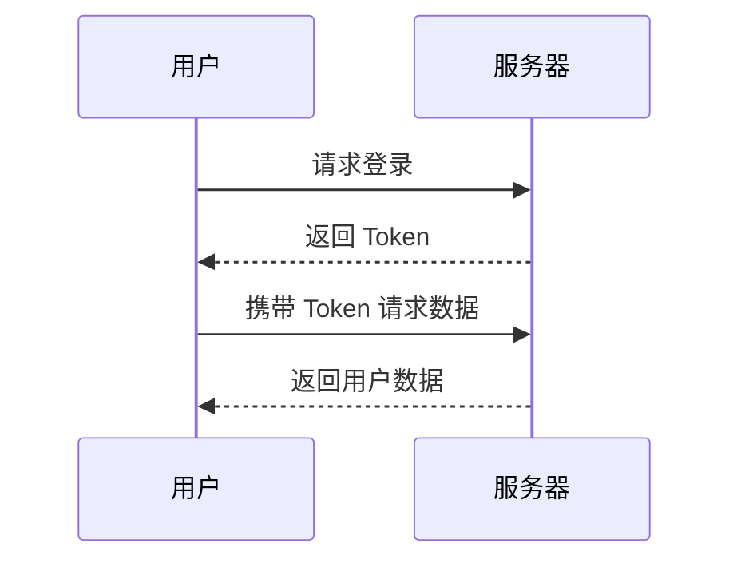

# 序言

结合电商系统场景学习Java 版 23 种设计模式

```markmap
# Markmap Example
## Links
- <https://markmap.js.org/>
- [GitHub](https://github.com/gera2ld/markmap)
## Related
- [coc-markmap](https://github.com/gera2ld/coc-markmap)
- [gatsby-remark-markmap](https://github.com/gera2ld/gatsby-remark-markmap)
## Features
### Features1
- links1
- links2
- links3
### Features2
- links
- **inline** ~~text~~ *styles*
- multiline
  text
- `inline code`
- `<video>`
```


