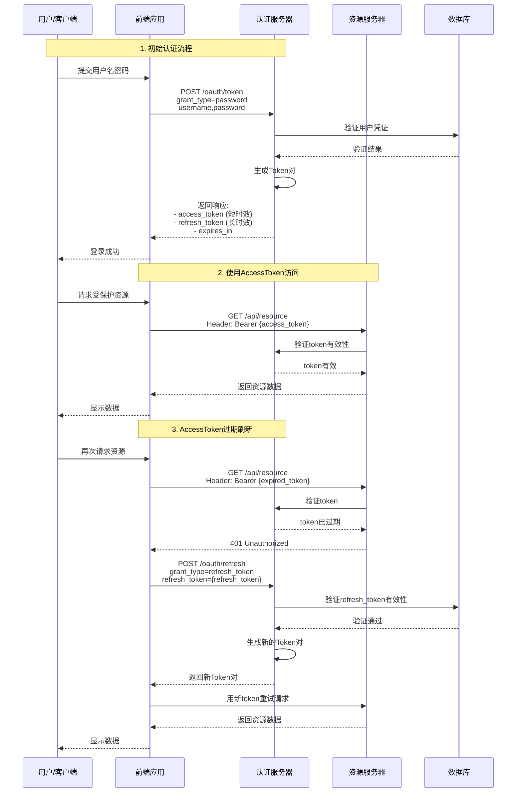

# 博客搭建-03. 添加思维导图(markmap)和mermaid图表支持
写文章的过程中，不可避免的添加思维导图和图表，方便读者快速理解文章内容，这里介绍如何添加。

## 一、安装插件
```shell
pnpm add vitepress-plugin-legend
```
## 二、配置插件
在`vitepress.config.ts`文件中添加如下配置：
```ts{2,6-15}
// ... 省略
import {vitepressPluginLegend} from 'vitepress-plugin-legend' // [!code ++]

export default defineConfig({
    // ... 省略
    markdown: {// [!code ++]
        config(md) {// [!code ++]
            vitepressPluginLegend(md, {// [!code ++]
                markmap: {// [!code ++]
                    showToolbar: true // [!code ++]
                },// [!code ++]
                mermaid: true // [!code ++]
            })// [!code ++]
        }// [!code ++]
    }// [!code ++]
})
```
修改`.vitepress/theme/index.ts`文件
```ts{2,3,8}
// ... 省略
import { initComponent } from 'vitepress-plugin-legend/component'// [!code ++]
import 'vitepress-plugin-legend/dist/index.css'// [!code ++]

export default {
// ... 省略
  enhanceApp({ app, router, siteData }) {
    initComponent(app)// [!code ++]
  }
} satisfies Theme
```

## 三、使用
> 在代码块中添加`markmap`或`mermaid`标签即可
### markmap示例
```markmap
# Markmap Example
## Links
- <https://markmap.js.org/>
- [GitHub](https://github.com/gera2ld/markmap)
## Related
- [coc-markmap](https://github.com/gera2ld/coc-markmap)
- [gatsby-remark-markmap](https://github.com/gera2ld/gatsby-remark-markmap)
## Features
### Features1
- links1
- links2
- links3
### Features2
- links
- **inline** ~~text~~ *styles*
- multiline
  text
- `inline code`
- `<video>`
```
### (可全屏查看)OAuth2.0下AccessToken和RefreshToken交互时序图


## 四、参考链接
1. [VitePress & Markmap](https://www.liujiajia.me/2025/4/8/vitepress-and-makrmap.html)
2. [vitepress-plugin-legend](https://github.com/flingyp/vitepress-plugin-legend)
3. [markmap:markdown + mindmap](https://markmap.js.org/repl)